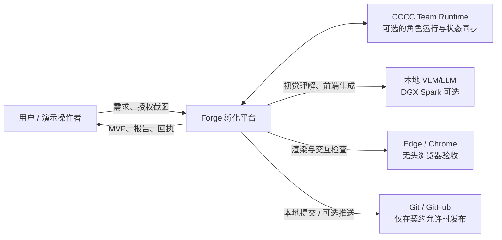
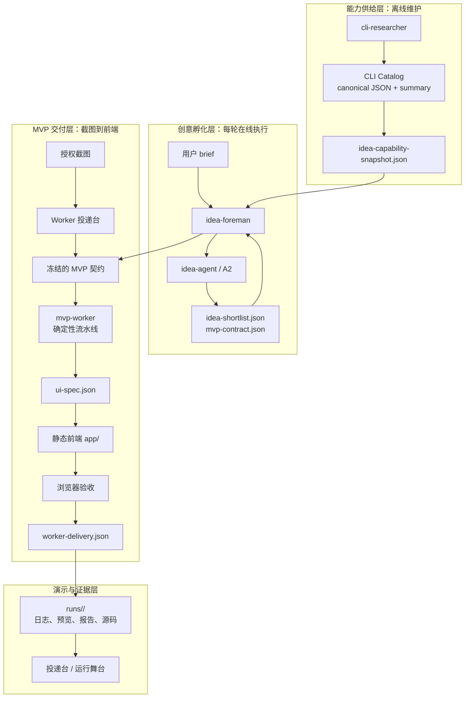
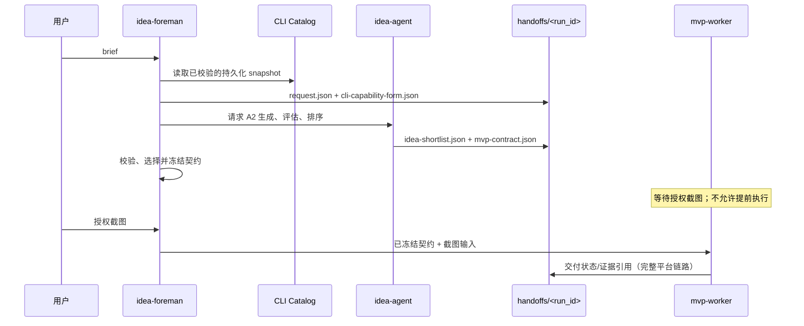

# Forge CLI-to-MVP 孵化平台架构文档

> 适用范围：`forge-cli-to-mvp` 仓库及 [`codex/publish-spark-worker-clean` 实现分支](https://github.com/advance-lion/forge-cli-to-mvp/tree/codex/publish-spark-worker-clean)所交付的黑客松 Demo。本文以代码和交接契约为准，描述整个“CLI 能力 → 创意 → 截图生成可运行 MVP → 验收交付”的平台，而不仅是 Worker。最后更新：2026-07-22。

## 1. 平台定位

Forge 是一个本地优先的多 Agent 孵化平台 Demo。它将长期维护的开源 CLI 能力目录，转化为可解释的产品创意候选；在确定一个方向后，使用**已授权的参考截图**生成全新的静态前端 MVP，并以浏览器验收和交付回执证明结果可运行。

平台的核心价值不是泛化的“点子生成”，而是可追溯地完成下面这条链路：

```text
CLI 能力目录 → 需求理解与创意排序 → 冻结 MVP 契约
→ 授权截图 → 视觉/布局规格 → 可运行前端 → 浏览器验收 → 交付证据
```

当前实现是单机、文件驱动的演示架构：无业务数据库、无消息队列、无对外生产 API。所有输入、阶段结果、运行日志和交付物均落在工作区，以便展示和复核。

## 2. 架构原则与职责边界

- **单一编排者**：`idea-foreman` 是完整平台链路唯一的全局协调者，持有同一轮 `run_id`，负责选择创意并冻结交给 Worker 的契约。
- **阶段隔离**：CLI Researcher 只维护目录；Idea Agent 只生成/评估/排序创意；MVP Worker 只执行已冻结的截图生成任务。Peer 之间不互相派发任务。
- **契约优先**：跨角色交接通过 JSON 文件完成；脚本负责校验关键字段、产物存在性和验收结果，模型不决定流程状态。
- **本地优先且可降级**：Worker 可使用本地 OpenAI 兼容 VLM/LLM，也可在配置允许时降级至 Codex CLI 或 Claude Code；实际引擎与降级原因必须记录。
- **可验证交付**：只有源码、预览图、浏览器报告和 `worker-delivery.json` 均符合契约时，运行才是 `PASS`。
- **参考而非复制**：截图仅用于理解空间结构、组件层级、信息密度和交互入口。生成结果不得复用来源品牌、Logo、图片、价格、文案或用户数据。

## 3. 系统上下文



平台内部由四个业务层组成：能力供给、创意孵化、MVP 交付和演示/运维。



## 4. 组件与代码地图

| 层 | 组件 | 主要目录/文件 | 职责 |
| --- | --- | --- | --- |
| 能力供给 | CLI Researcher | `agents/cli-researcher/cli-catalog/` | 从多个精选上游源同步、合并、分类、渲染和校验 CLI 数据。`catalog/data/*.json` 是规范数据，`cli-summary.json` 是轻量路由索引。 |
| 能力供给 | Stage-1 交接适配器 | `scripts/build_cli_handoff.py` | 把持久化快照转为某轮 `cli-capability-form.json`；只有刷新/维护时才更新快照。 |
| 编排 | Idea Foreman | `agents/foreman/AGENTS.md`、`scripts/run_incubation_pipeline.py` | 标准化请求，保持 `run_id`，调度 A2，校验交接物，选择并冻结 MVP 契约。 |
| 孵化 | Idea Agent / A2 | `agents/idea-agent/` | 基于需求和能力快照生成能力链、候选创意、四维评分与排序；不直接启动 Worker。 |
| Worker | MVP Worker | `worker/ROLE.md`、`scripts/worker_pipeline.py` | 将截图和契约变为视觉规格、前端、验收结果和交付回执。 |
| 本地服务 | 投递台/API | `scripts/worker_intake_server.py` | 提供截图上传、本地运行查询、产物静态访问、展示舞台和孵化触发 API。 |
| 展示 | Incubation Showcase | `index.html`、`styles.css`、`app.js`、`demo-session.css` | 将能力目录、Idea 结果、Worker 阶段状态、预览和回执组合为现场演示页面。 |
| 质量与交付 | Prepare / QA / Finalize | `scripts/prepare_run.py`、`browser_acceptance.py`、`finalize_delivery.py` | 隔离输入、浏览器验收、生成最终回执。 |
| 环境与分发 | Spark/CCCC 包 | `config/`、`scripts/package_for_spark.ps1`、`exports/mvp-worker-agent/` | 管理本地模型配置、打包干净演示包、导入 `mvp-worker` 到 CCCC。 |

## 5. 角色协作模型

### 5.1 角色与权限

| 角色 | 输入 | 输出 | 不负责 |
| --- | --- | --- | --- |
| `cli-researcher` | 上游 CLI 数据源、已有 catalog | 校验通过的 catalog、`idea-capability-snapshot.json` | 创意生成、创意选择、实现 MVP |
| `idea-foreman` | 用户 brief、持久化快照 | 轮次目录、能力表、已冻结的 MVP 契约 | 重新构建目录、给 MVP 编码 |
| `idea-agent` | 规范化需求、run-scoped 能力表 | `idea-shortlist.json`、`mvp-contract.json` | 直接派发或启动 Worker |
| `mvp-worker` | 已授权截图、MVP 契约或批次清单 | `ui-spec.json`、前端源码、QA 报告、交付回执 | 重新评估创意、改变产品范围 |
| CCCC Runtime | 角色定义、任务和状态事件 | 角色运行状态、协作消息、阶段镜像 | 替代确定性流水线推进阶段 |

完整平台链路中，`idea-agent → mvp-worker` 的直接通信被禁止；必须由 Foreman 在选题与授权截图都满足后交接。Worker 投递台是一个**独立的 Worker 测试入口**，它可以跳过孵化阶段创建测试契约，但不改变完整协作链的职责划分。

### 5.2 孵化时序



## 6. 关键业务流程

### 6.1 Stage 1：持久化 CLI 能力维护

`cli-researcher` 不属于通常的在线请求路径。它按维护周期或用户明确要求执行：

1. 从 `config/sources.json` 所列上游源同步 CLI 元数据；需要时做人工修订、质量检查和目录渲染。
2. 以 `catalog/data/*.json` 保存每条 CLI 的规范记录，并产生 `catalog/cli-catalog.md` 和 `catalog/cli-summary.json`。
3. 运行 `python -m cli_catalog validate`，再通过 `build_cli_handoff.py --refresh-snapshot` 发布 `idea-capability-snapshot.json`。
4. 快照记录汇总索引、完整记录根路径、schema、字段文档、校验结果、统计计数和与当前场景相关的能力记录。

正常孵化只消费该快照；快照缺失、校验失败、用户要求刷新或操作策略判定过期时，Foreman 才要求 Stage 1 维护。

### 6.2 Stage 2：创意生成、评估与冻结

1. Foreman 在 `handoffs/<incubation-run>/request.json` 写入用户请求，并从持久快照生成 `cli-capability-form.json`。
2. Idea Agent 使用 A2 workflow 选择相关能力、构造能力链，生成候选创意。
3. 每个候选都显式给出 **视觉表达、通用性、痛点、创新性** 四项评分、权衡和推荐理由。
4. Idea Agent 输出 `idea-shortlist.json` 与仅包含被选方案的 `mvp-contract.json`。
5. Foreman 校验两份文件，按用户选择或预设规则冻结一个方案。默认优先选择最直接体现“截图到可运行应用”能力的方案。

`run_incubation_pipeline.py` 在可用时按 **Codex CLI → Claude Code → 确定性交接适配器** 尝试完成 Stage 2；无论使用哪种获批执行环境，写出的 JSON 交接物都是唯一的记录契约。

### 6.3 Stage 3：Screenshot-to-App 交付

投递台接收一张已授权的 JPG、PNG 或 WEBP 参考图（最大 16 MB）以及虚构应用名称和类型。它使用 `contracts/mvp-contract.sample.json` 创建测试契约，或将输入补充到 Foreman 已冻结的契约中，然后执行：

1. `prepare_run.py` 校验 `authorized_for_demo`、必填契约字段和图片存在性；复制图片到独立 run，并写入输入 SHA-256 和环境上下文。
2. `worker_pipeline.py` 生成并校验 `ui-spec.json`。规格必须描述真实观察到的区块顺序、几何、主色块、信息密度、可见状态与交互入口，同时列出替换的来源资产。
3. Worker 在 `runs/<run_id>/app/` 中仅生成 `index.html`、`styles.css`、`app.js`，使用本地 mock 数据且不发起外部网络请求。
4. 浏览器验收以契约中的视口加载 `?qa=1`，产生预览 PNG，检查所有 `data-testid`，并验证搜索/筛选和主操作确实改变页面状态。
5. `finalize_delivery.py` 汇总验收报告和必需文件，写出 `worker-delivery.json`。

每一阶段都会写入 `STARTED`、`PASS` 或 `FAIL`。当前确定性流水线在阶段或验收失败时结束本次 run，而不会无限停留在“处理中”；契约中的最大修复次数为后续可控修复策略保留了边界。

## 7. 运行时服务、页面与 API

`scripts/worker_intake_server.py` 在 `127.0.0.1:4181` 启动单一 HTTP 服务。它只绑定 loopback；在 DGX Spark 上从笔记本访问时应使用 SSH 隧道。

| 路径 | 使用者 | 说明 |
| --- | --- | --- |
| `/` | 操作者 | Worker 投递台：上传截图、创建/派发试跑、查看最近证据。 |
| `/stage?run=<run_id>` | 展示人员 | 根目录展示前端；轮询孵化、Worker、CCCC 状态并嵌入生成的 MVP。 |
| `/apps/<run_id>/...` | 浏览器 | 只读提供某次 run 的生成前端。 |
| `/files/<run_id>/...` | 操作者/舞台 | 只读提供同一 run 的图片、日志、报告、规格和回执。 |
| `/handoffs/...` | 舞台/复核 | 只读提供 Foreman 与 Idea Agent 的交接物。 |
| `/api/catalog` | 展示前端 | 返回 `cli-summary.json`。 |
| `/api/incubation`、`/api/incubation/test` | 展示前端 | 查询或触发一次 Foreman 孵化。 |
| `/api/intake` | 投递台 | 创建契约、准备 run；勾选派发后启动 Worker。 |
| `/api/runs`、`/api/runs/<run_id>`、`/api/stage` | 展示前端 | 返回运行状态、执行引擎、产物链接和 CCCC 阶段镜像。 |

服务对 run ID、路径穿越和可访问文件做限制；`/apps`、`/files`、`/handoffs` 均不能跳出预期根目录。

## 8. 契约、状态与目录布局

### 8.1 交接与验收契约

| 文件 | 创建者 | 消费者 | 作用 |
| --- | --- | --- | --- |
| `handoffs/<run_id>/request.json` | Foreman | Idea Agent | 原始/规范化需求与轮次上下文。 |
| `cli-capability-form.json` | Foreman / Stage-1 适配器 | Idea Agent | 指向持久目录的 run-scoped 引用，而非复制整个 catalog。 |
| `idea-shortlist.json` | Idea Agent | Foreman、展示页 | 排序候选、四维评分、能力链、取舍和推荐项。 |
| `mvp-contract.json` | Idea Agent，Foreman 冻结 | MVP Worker | 选中创意、授权截图要求、视觉方向、交互、验收和交付要求。 |
| `run-context.json` | Prepare Run | Worker/复核者 | 本地副本、输入哈希、目录与时间上下文。 |
| `ui-spec.json` | Worker 视觉阶段 | Worker 脚手架阶段/复核者 | 截图的结构与替换资产说明。 |
| `acceptance-report.json` | 浏览器验收 | Finalize/复核者 | 页面、测试标识、交互和预览的检查证据。 |
| `worker-delivery.json` | Finalize | Foreman/投递台 | 最终 `PASS`/`FAIL`、产物路径、缺失项和发布状态。 |

`mvp-contract.json` 至少约束 `run_id`、交接方、截图授权、虚构应用定义、视觉要求、必需交互、验收视口与 test ID、必需检查、最大修复次数以及交付文件清单。它是 Worker 的唯一范围边界。

### 8.2 文件布局

```text
agents/
  cli-researcher/                 Stage 1 catalog 与 CCCC actor capsule
  idea-agent/                     A2 workflow、角色说明和本地证据
  foreman/                        全局编排者说明
config/                           运行时选择、模型示例和本机私密配置
contracts/                        样例契约、演示批次和直接投递契约
handoffs/<incubation-run>/        Stage 1/2 的跨角色交接证据
runs/<run-id>/                    一次 Worker run 的隔离工作区
  input/reference.*               复制后的授权截图
  app/                            交付的静态 HTML/CSS/JS
  artifacts/                      preview.png、acceptance-report.json
  mvp-contract.json               本次执行的契约副本
  run-context.json                输入哈希与准备信息
  ui-spec.json                    视觉规格
  run-execution.json              请求/实际引擎及降级记录
  worker-pipeline.log             阶段和执行日志
  worker-delivery.json            交付回执
exports/                          可导入 CCCC 的 Agent 和 Spark 演示包
logs/                             本地服务和演示日志
scripts/                          确定性编排、验收、打包和辅助命令
```

运行目录以 `run_id` 隔离，历史运行不会被新任务覆盖。`runs/`、`inputs/` 和本机模型配置已被 Git 忽略，防止将图片或凭据意外提交；`handoffs/`、`logs/` 与 `exports/` 是演示工作产物，提交前应按交付需要显式审查。

## 9. Worker 执行引擎与 CCCC 集成

### 9.1 执行引擎选择

引擎由单次请求、`MVP_WORKER_BACKEND`、`config/worker-runtime.local.json` 及 `config/local-model.local.json` 共同决定。

```text
local-openai（DGX Spark 上的 OpenAI 兼容 VLM/LLM）
  ├─ visual：授权截图 → ui-spec.json
  └─ scaffold：ui-spec.json → 静态前端
       └─ 不可用或无效时：Codex CLI → Claude Code

codex / claude / cccc-codex
  └─ 直接执行对应的视觉与脚手架阶段
```

实际运行会把请求引擎、激活引擎、健康信息、后备顺序和降级原因写入 `run-execution.json`。因此必须根据证据文件展示实际推理来源；CLI 兜底不得表述为 DGX 本地推理。

### 9.2 CCCC 的位置

CCCC 是角色协作与可视化状态的运行环境，不是 Worker 流水线的状态机。服务在需要时启动 `mvp-worker` actor，Worker 在各阶段向 CCCC 同步标准状态行；阶段的真实推进仍由 `worker_pipeline.py` 依次执行。

`exports/mvp-worker-agent/` 是可导入 CCCC 的交付包定义，包含入口、流水线、推荐 `local-openai` 后端、所需环境变量和不导出的敏感内容。`scripts/package_for_spark.ps1` 打包干净的 Spark 试跑包：保留演示需要的持久化快照和授权样图，排除旧 runs、日志、工具缓存、临时契约和本地密钥。

## 10. 验收、交付与发布规则

浏览器验收运行一个临时静态 Web 服务，并使用 Edge 或 Chrome 的无头模式执行以下检查：

1. `app/index.html`、`styles.css`、`app.js` 全部存在。
2. 页面真实 DOM 包含契约规定的全部 `data-testid`。
3. `?qa=1` 执行真实的筛选/搜索和主操作函数，并把观察结果写入 `[data-testid="qa-result"]`；不得硬编码成功。
4. 契约列出的必需检查均通过，并已生成有效 PNG 预览图。

验收通过后，Worker 可为本地产物创建 Git 提交。只有契约明确开启 GitHub 交付、提供目标仓库/分支且操作者已授权时，才可推送远端。默认 Demo 不创建或推送 GitHub 仓库。

## 11. 配置、部署与常用入口

### 11.1 本地演示

```powershell
.\scripts\python.cmd scripts\worker_intake_server.py --port 4181
```

- 投递台：`http://127.0.0.1:4181/`
- 展示舞台：`http://127.0.0.1:4181/stage`
- 浏览器路径可用 `MVP_WORKER_BROWSER` 覆盖。

### 11.2 DGX Spark

1. 基于 `config/local-model.example.json` 创建被 Git 忽略的 `config/local-model.local.json`。
2. 填写 OpenAI 兼容服务的 `base_url`、本机 `api_key`、支持视觉的模型名和超时参数。
3. 设置 `FORGE_RUNTIME_LABEL='DGX Spark'` 与 `MVP_WORKER_BACKEND='local-openai'`，再启动投递台。
4. 如从笔记本访问 loopback 服务，使用 SSH 转发 `4181` 端口。

详见 [DGX-SPARK-TEST.md](https://github.com/advance-lion/forge-cli-to-mvp/blob/codex/publish-spark-worker-clean/DGX-SPARK-TEST.md)。本地模型端点与 API key 不得写入 Git、打包文件或录屏。

## 12. 已知取舍与演进方向

- 该系统优先展示清晰的责任边界和可复核证据，尚不是面向多租户/高并发的生产服务；文件系统状态、轮询和本地进程不适合水平扩展。
- 运行产物包含用户提供的截图和生成结果，没有内建的保留策略、对象存储或细粒度访问控制；演示结束后需按数据要求清理本地目录。
- 创意和 UI 生成可能使用模型，但流程门控、产物校验、浏览器验收和最终 PASS/FAIL 都由确定性脚本负责。
- 若扩展到生产，优先替换的基础设施是：持久化任务/状态存储、对象存储、队列与重试、鉴权、审计与密钥管理；现有 JSON 契约可作为这些服务之间的稳定接口。

## 13. 关联文档

- [团队协作与交接约定](https://github.com/advance-lion/forge-cli-to-mvp/blob/codex/publish-spark-worker-clean/TEAM-ARCHITECTURE.md)
- [Worker 执行角色](https://github.com/advance-lion/forge-cli-to-mvp/blob/codex/publish-spark-worker-clean/worker/ROLE.md)
- [Worker 流水线说明](https://github.com/advance-lion/forge-cli-to-mvp/blob/codex/publish-spark-worker-clean/worker/PIPELINE.md)
- [CLI Catalog 使用与结构](https://github.com/advance-lion/forge-cli-to-mvp/blob/codex/publish-spark-worker-clean/agents/cli-researcher/cli-catalog/README.md)
- [录制与现场演示说明](https://github.com/advance-lion/forge-cli-to-mvp/blob/codex/publish-spark-worker-clean/RECORDING.md)
- [DGX Spark 试跑说明](https://github.com/advance-lion/forge-cli-to-mvp/blob/codex/publish-spark-worker-clean/DGX-SPARK-TEST.md)
