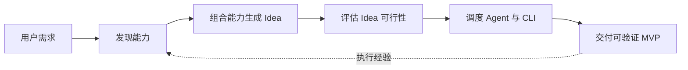
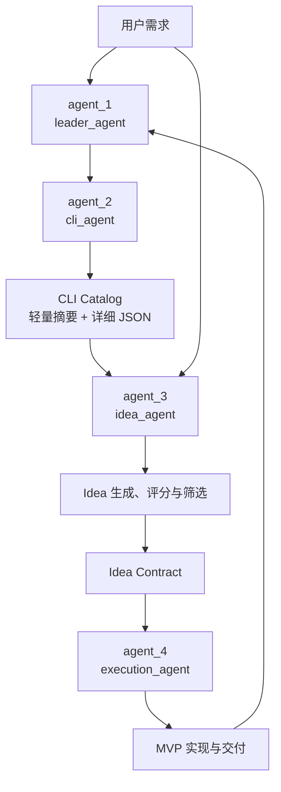
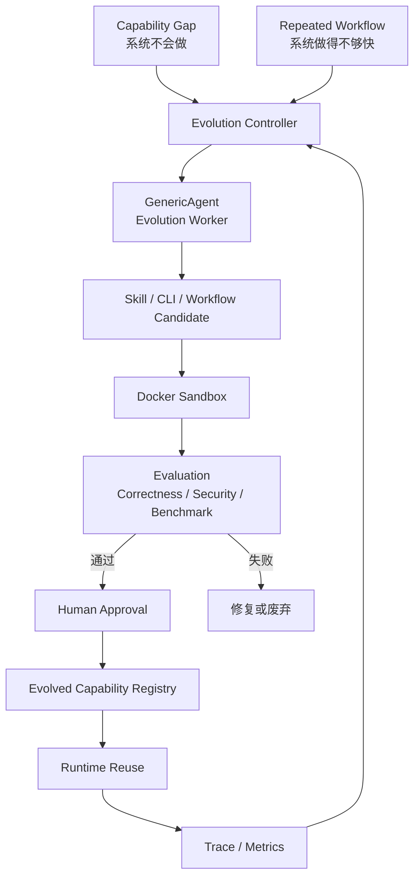

## 核心实现



| 阶段              | 要回答的问题                 | 核心产物                     |
| ----------------- | ---------------------------- | ---------------------------- |
| **01 · 发现能力** | 市场上有哪些真实可用的 CLI？ | CLI Catalog                  |
| **02 · 组合能力** | 哪些能力可以组合成产品？     | 候选 Idea                    |
| **03 · 评估Idea** | 哪个 Idea 值得优先实现？     | Score Report / Idea Contract |
| **04 · 实现 MVP** | 如何把选定的 Idea 做出来？   | MVP / Artifact / Trace       |

## Agent Team

当前系统由四个核心 Agent 组成，并通过 CCCC 进行编排。四个 Agent 不是四个独立的聊天窗口，而是一条有状态、可交接、可追踪的协作流程。



### `agent_1` · leader_agent

全局协调者，负责接收用户目标、创建任务上下文、推进阶段、检查产物、处理失败和汇总最终结果。

Leader 不亲自完成所有专业工作，而是保证正确的 Agent 在正确的阶段处理正确的任务。

### `agent_2` · cli_agent

能力发现者，负责调研市场 CLI，提取功能、分类、依赖、可调用性和验证信息，建立面向 Agent 的 CLI Catalog。

CLI Catalog 采用两级结构：轻量摘要用于快速检索，详细 JSON 用于选中工具后的按需深入读取。这样既能覆盖大量 CLI，又不会让后续 Agent 的上下文被完整工具资料占满。

### `agent_3` · idea_agent

产品方向分析者，负责根据用户需求和 CLI Catalog 组合真实能力，生成候选 Idea，并按照需求价值、能力覆盖度、MVP 可实现性、技术复杂度、风险和扩展潜力等指标进行评分。

最终输出的是一份可执行的 Idea Contract，而不是一句抽象的产品描述。

### `agent_4` · execution_agent

产品执行者，负责读取 Idea Contract，拆解实现任务，调度 CLI、API、脚本和开发工具，完成 MVP、测试、验证和交付。

Execution Agent 不重新决定产品方向，也不能把模型自述当作成功证据。所有能力调用都必须经过 Runtime 的治理和验证。

## CCCC 与 Runtime

当前多 Agent 协作基于 [CCCC](https://github.com/ChesterRa/cccc) 实现。

CCCC 负责 Agent Team 的组织、任务委派、上下文传递、状态协调和流程推进，解决的是：

> **谁来做？什么时候做？如何协作？**

EvoCLI Runtime 负责能力路由、权限检查、真实执行和结果验证，解决的是：

> **能不能做？如何执行？结果是否真的完成？**

```mermaid
flowchart LR
    TASK[Task] --> ROUTER[Capability Router]
    ROUTER --> REG[Capability Registry]
    REG --> POLICY[Policy Engine]
    POLICY --> EXEC[Execution Backend]
    EXEC --> PROVIDER[CLI / API / Provider]
    PROVIDER --> OBS[Observation]
    OBS --> VERIFY[Deterministic Verification]
    VERIFY --> RESULT[Artifact / Trace / Result URL]
```



两层之间的关系是：

```text
CCCC       → 负责 Agent 编排
Agent      → 负责理解、规划和提出方案
Runtime    → 负责权限控制、能力路由和实际执行
Provider   → 负责完成真实的软件操作
Verifier   → 负责确认任务是否真正完成
```

| 层级         | 负责什么                           | 不负责什么                  |
| ------------ | ---------------------------------- | --------------------------- |
| **CCCC**     | Agent 编排、任务委派、上下文传递   | 不直接替代 Runtime 执行工具 |
| **Agent**    | 理解需求、规划任务、提出结构化方案 | 不绕过策略直接执行任意命令  |
| **Runtime**  | 能力路由、权限治理、执行和验证     | 不替用户决定产品方向        |
| **Provider** | 提供具体 CLI、API 或 Workflow 能力 | 不决定整个任务的流程        |

Agent 可以提出结构化 Capability 计划，但不能直接运行任意 Shell、请求不必要的凭据或伪造执行结果。Runtime 会检查 Provider、输入 Schema、敏感字段、风险等级、写入审批和执行位置，然后才允许工具运行。

对于写操作，命令返回成功并不等于业务目标完成。系统还需要通过文件检查、结构化校验、产物检查或写后读回确认结果，只有验证通过后才能将任务标记为 `VERIFIED`。

## Self-Evolution

IdeaBricks 的自进化不是让模型无限制地修改自身代码，而是一套由 EvoCLI Runtime 负责治理的能力生命周期机制。

当系统发现自己不会完成某项任务，或者发现已有工作流效率不高时，系统会生成进化候选。候选必须经过隔离测试、确定性评估、版本管理和必要的人工审批，之后才能进入 Runtime 复用。



### Capability Evolution · 0 → 1

当系统没有合适的 Provider 时，Evolution Controller 识别能力缺口，调度 Evolution Worker 分析任务并提出新的 Skill、CLI 或 Workflow 候选。候选经过 Builder 生成、Docker Sandbox 测试和功能验证后，才可能注册为新能力。

### Performance Evolution · 1 → Better

当系统已经能够完成任务，但存在调用次数过多、执行耗时过长、Token 消耗较高或重复步骤较多等问题时，系统读取 Trace 和 Metrics，生成优化版本。

优化版本必须与原版本进行 Benchmark，并且满足正确性不下降，同时在延迟、调用次数、重试次数或 Token 使用量等方面有所改善，才允许被 Promote。

| 进化方向                  | 触发原因             | 目标                   | 关键门槛                   |
| ------------------------- | -------------------- | ---------------------- | -------------------------- |
| **Capability Evolution**  | 系统没有合适能力     | 学会原本不会做的事     | 功能正确、安全、可复用     |
| **Performance Evolution** | 已有工作流重复或低效 | 把已经会做的事做得更快 | 正确性不下降，性能指标改善 |

自进化中的职责边界是：

- `GenericAgent` 负责分析和提出候选；
- `Builder` 负责生成实现；
- `Sandbox` 负责隔离测试；
- `Evaluation` 负责判断结果；
- `EvoCLI Runtime` 负责版本发布、启用和回滚。